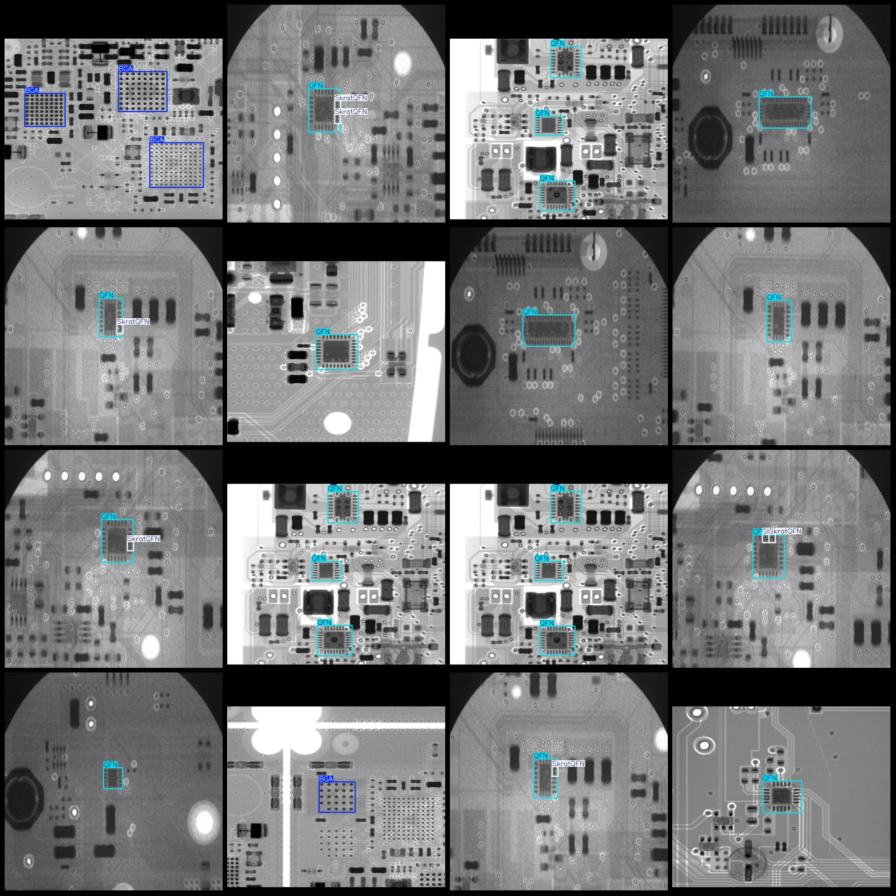
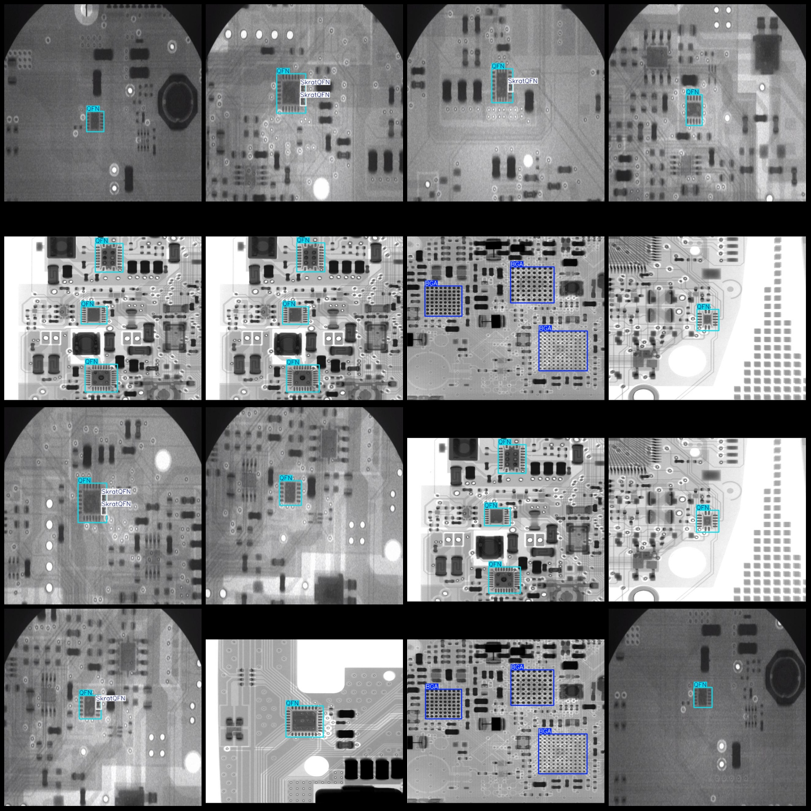

# X-ray Image Chip Package Defects Detection Dataset VOC+YOLO Format 1709 Images 3 Categories

Dataset format: Pascal VOC format + YOLO format (txt file without segmentation path, only containing jpg images and corresponding VOC format xml files and yolo format txt files).
Number of images (number of jpg files): 1709
Number of annotations (number of xml files): 1709
Number of annotations (number of txt files): 1709
Number of annotation categories: 3
Annotation category names (notice that the order of categories in the yolo format does not correspond to this, but according to the labels folder's classes.txt): ["BGA", "QFN", "SkratQFN"]
Each category of boxes:
BGA (Ball Grid Array packaging) = 638
QFN (Quad Flat No-Lead PACKAGING) = 1569
SkratQFN (Scratch QFN) = 307
Total boxes: 2514
Number of images each category occupies:
BGA occupies images = 331
QFN occupies images = 1377
SkratQFN occupies images = 240
Image resolution: 640x640
Using labeling tool: labelImg
Labeling rules: draw a box around the category
Important note: The dataset does not have been divided into training, validation, and test sets; it needs to be divided by oneself.
Special declaration: This dataset does not guarantee the accuracy of the trained model or weight files.
Image preview:
Annotation example:
## Images

Here is a pay link on Stripe ( https://buy.stripe.com/3cs8yP7sY87d0vu9AB ). Please contact me lonlonago@foxmail.com after funding $89, and I will send you a complete data files , thank you!

